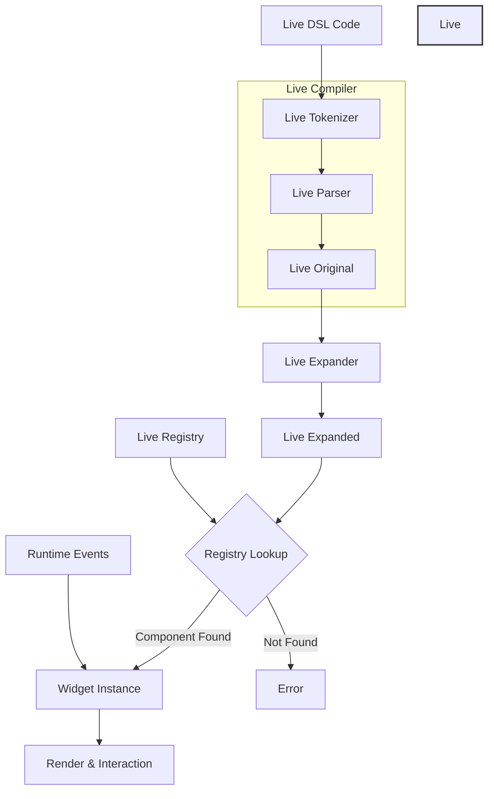

# 基本概念


Live 语言是一个专门用于 UI 组件和样式的领域特定语言（DSL）。它的基本结构是以节点为单位，每个节点可以包含属性和子节点。

`Live DSL`是在运行时实时编译的，支持热重载和动态更新。

这种设计适合的场景如下：

- 需要高度动态性的UI系统
- 需要热重载的开发环境
- 需要运行时修改UI的场景


## 生命周期

Live DSL 运行时编译大概过程如下：


### 1. 输入阶段

第一步输入 Live Documents 。

```rust
// Live DSL 代码
Button = {
    width: 100,
    height: 50,
    text: "Click me"
}
```

### 2. Live Compiler 阶段

`Live Tokenizer` 分词

```rust
pub struct TokenWithSpan {
    pub token: LiveToken,
    pub span: TextSpan
}

// 将代码转换成 token 流
[
    Token::Ident("Button"),
    Token::Punct("="),
    Token::Open(Brace),
    Token::Ident("width"),
    Token::Punct(":"),
    Token::Int(100),
    ...
]
```

`Live Parser` 解析

```rust
pub struct LiveParser<'a> {
    pub token_index: usize,
    pub file_id: LiveFileId,
    pub tokens_with_span: Cloned<Iter<'a, TokenWithSpan>>,
    // ...
}

// 将 token 流解析成初始的节点结构
```
`Live Original` 存储了从源代码解析得到的原始节点数据，包含：

- 保存了完整的源码映射信息
- 包含了设计时和编辑时的元信息
- 作为展开过程的输入
- 支持错误定位和报告

```rust
pub struct LiveOriginal {
    pub nodes: Vec<LiveNode>,           // 解析出的节点列表
    pub edit_info: Vec<LiveNode>,       // 编辑相关的元数据节点
    pub design_info: Vec<LiveDesignInfo>, // 设计阶段的信息
    pub tokens: Vec<TokenWithSpan>,     // 源代码的token流
}
```
比如：

```rust
// 源代码
Button = {
    width: 100,
    height: 50,
    label = {
        text: "Click me"
    }
}

// 解析成 LiveOriginal.nodes
[
    LiveNode { id: "Button", value: Object },
    LiveNode { id: "width", value: Int64(100) },
    LiveNode { id: "height", value: Int64(50) },
    LiveNode { id: "label", value: Object },
    LiveNode { id: "text", value: String("Click me") },
    LiveNode { value: Close },  // label的结束
    LiveNode { value: Close }   // Button的结束
]
```
`LiveOriginal` 相当于 Live DSL 的 AST(抽象语法树)。

### 3. 展开阶段

展开阶段是对 DSL 中的组件声明进行扩展(expand)，比如处理属性展开、继承、建立组件关系，并设置运行时上下文。这为后续的渲染和交互打下基础。

```rust
// 简写形式
Button = <Button> {
    text: "Click me"
}

// 展开后
Button = <Button> {
    text: "Click me",
    draw_text: {
      color: #000
    },
    draw_bg: {...}
}
```
Live Expander

```rust
pub struct LiveExpander<'a> {
    pub live_registry: &'a LiveRegistry,
    pub in_crate: LiveId,
    pub in_file_id: LiveFileId,
    pub errors: &'a mut Vec<LiveError>,
}

// 处理继承、引用等关系
```
Live Expanded

```rust
pub struct LiveExpanded {
    pub nodes: Vec<LiveNode>,
}
```

### 4. 实例化阶段

BTreeMap 具有以下特点：

- BTreeMap 默认按 Key 排序，可以保证组件初始化、渲染和销毁的顺序稳定性；正确处理父子组件间的依赖关系；方便调试和日志记录。
- BTreeMap 的树状结构让 LiveNode 数据的内存布局更加紧凑。相关组件数据倾向于在内存中相邻，对缓存友好，可能使实际性能比 HashMap 更好。BTreeMap 的空间利用率通常比 HashMap 高。
- BTreeMap 的树结构更加稳定，增删组件不会导致大规模内存重分配，性能可以更好的预测。

所以它适合用于 Widget Registry 。

```rust
pub struct WidgetRegistry {
    pub map: BTreeMap<LiveType, (LiveComponentInfo, Box<dyn WidgetFactory>)>,
}
```
Widget 实例

```rust
pub trait Widget: WidgetNode {
    fn handle_event(&mut self, cx: &mut Cx, event: &Event, scope: &mut Scope);
    fn draw(&mut self, cx: &mut Cx2d, scope: &mut Scope) -> DrawStep;
    // ...
}

pub trait WidgetNode: LiveApply {
    // 获取设计时组件实例
    fn widget_design(&mut self) -> Option<&mut dyn WidgetDesign> {
        return None;
    }
    // 通过 UID 查找组件
    fn uid_to_widget(&self, _uid: WidgetUid) -> WidgetRef;
    // 查找组件
    fn find_widgets(&self, _path: &[LiveId], _cached: WidgetCache, _results: &mut WidgetSet);
    // 计算布局信息
    fn walk(&mut self, _cx: &mut Cx) -> Walk;
    // 获取区域
    fn area(&self) -> Area;
    // 重绘
    fn redraw(&mut self, _cx: &mut Cx);
}
```
Widget Node  是 UI 组件树中的基本节点，它提供基础的布局、遍历和绘制能力，且负责组件的区域管理和重绘，支持组件查找和导航。 同时是 Widget trait 的基础要求。

一个 Widget 实例可以包含多个 Node，每个 Node 负责特定的底层功能。Widget 通过组合 Node 实现完整功能。

### 5. 运行时交互

```rust
impl Widget {
    fn handle_event(&mut self, cx: &mut Cx, event: &Event, scope: &mut Scope) {
        // 处理事件
    }

    fn draw(&mut self, cx: &mut Cx2d, scope: &mut Scope) {
        // 渲染逻辑
    }
}
```
Widget 通过 `Event`、`Action` 和 `Scope` 这三个重要机制来实现运行时交互。其细节在事件章节详细介绍。

## Live Node

Live Node 可以理解为解析以后的每个 AST 节点。

### 1. 节点的基本结构

在代码实现中，节点由 LiveNode 结构表示：

```rust
pub struct LiveNode {
    pub origin: LiveNodeOrigin,  // 节点的源信息
    pub id: LiveId,             // 节点的标识符
    pub value: LiveValue,       // 节点的值
}
```

### 2. 节点的类型(LiveValue)

节点可以包含多种类型的值：

```rust
pub enum LiveValue {
    // 基础值类型
    None,
    Bool(bool),
    Int64(i64),
    Float64(f64),
    Color(u32),
    String(Arc<String>),

    // 复合类型
    Object,            // 对象节点
    Array,            // 数组节点
    Clone{...},       // 克隆/继承节点
    Class{...},       // 类定义节点

    // DSL 特殊类型
    DSL{...},         // DSL代码块
    Import(...),      // 导入声明
}
```

### 3. 节点的组织方式

- 基础节点

```rust
Button = {  // 这是一个节点
    width: 100,    // 这也是一个节点
    height: 50,    // 这也是一个节点
}
```
- 嵌套节点

```rust
Window = {                  // 父节点
    header = {             // 子节点
        title = {          // 孙节点
            text: "Hello"  // 叶节点
        }
    }
}
```
- 数组节点

```rust
List = {
    items: [          // 数组节点
        {text: "1"},  // 子节点 1
        {text: "2"},  // 子节点 2
        {text: "3"}   // 子节点 3
    ]
}
```
